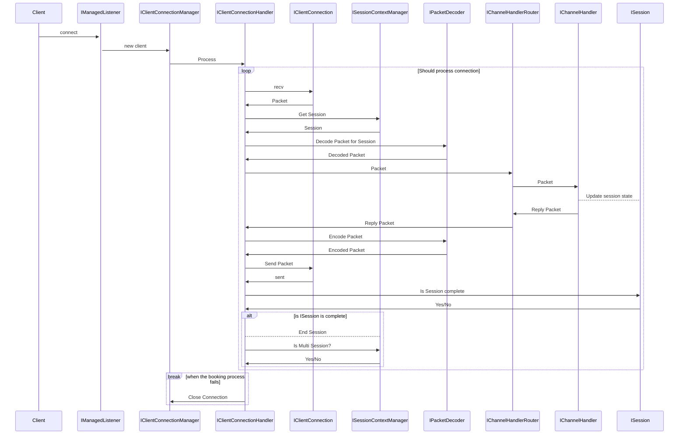
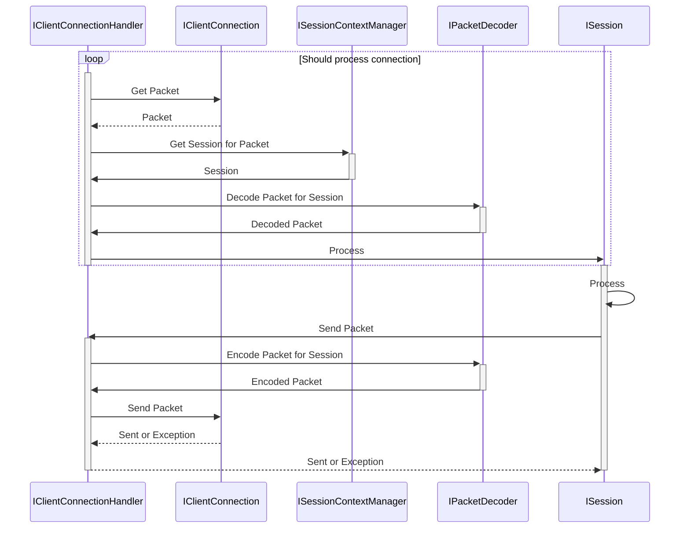
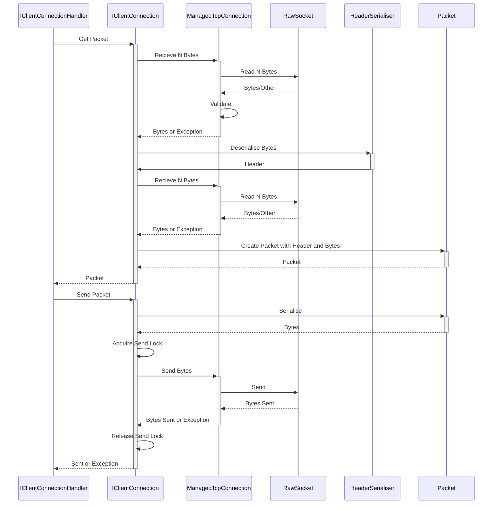

The pattern is a but tricky and lots of concepts are stuck in a coordinator. Each packet has to wait for a return. Ideally a session and connection isn't split. The session could instead have a connection to a tcp message send queue, and the tcp session sends packets to a session queue.

Looking into IClientConnectionHandler, there exists a producer loop that:

1. reaches out the the underlaying connection to get a packet
2. interacts with a session context manager to get or create a session
3. interacts with a packet decoder to decode the packet for a session
4. sends the decoded packet to the session

Eventually the Session will send a Packet to IClientConnectionHandler then:
1. Encodes the Packet
2. Sends the Packet to the ClientConnection which (shown in the next diagram)
   1. calls the async send (which awaits for other sends to complete) and
   2. sends the packet

The send portion follows an async chain and the ISession should wait for it's send to complete. Then if something goes wrong in the send, ISession can handle the exception in whatever way it needs (e.g. setting the session is failed). Similarly, each component on the send chain can hook exceptions and do something along the way.

IClientConnectionHandler communicates with an IClientConnection to get Packets. The IClietnConnection communicates with a ManagedTcpConnection (impliments IManagedConnection) to get raw bytes that make up the packet, and validates the bytes/components so that a Packet returned to the IClientConnectionHandler is valid. The ManagedTcpConnection that in turn communicates to a RawSocket (OS sepecific socket type) and handles all it's related quirks, such as empty responses, timeouts etc and either provides nothing or a entirely fulfilled request to the ManagedTcpConnection. The ManagedTcpConnection will know if the RawSocket has been disconnected, and can pass these issues up to the IClientConnectionHandler.

