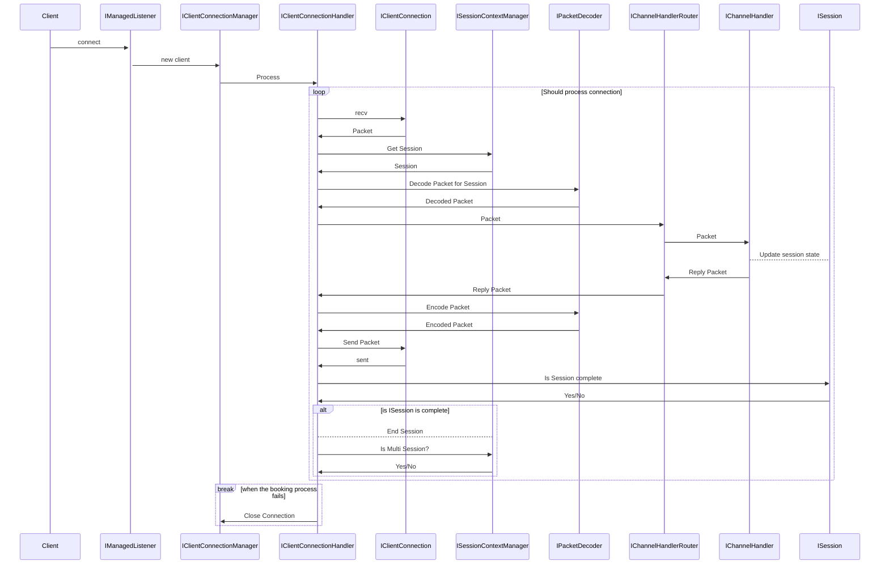

```mermaid
sequenceDiagram;
    Client ->> +IManagedListener: connect
    IManagedListener ->> IClientConnectionManager: new client
    IClientConnectionManager ->> IClientConnectionHandler: Process
    loop Should process connection
        IClientConnectionHandler ->> IClientConnection: recv
        IClientConnection ->> IClientConnectionHandler: Packet
        IClientConnectionHandler ->> ISessionContextManager: Get Session
        ISessionContextManager ->> IClientConnectionHandler: Session
        IClientConnectionHandler ->> IPacketDecoder: Decode Packet for Session
        IPacketDecoder ->> IClientConnectionHandler: Decoded Packet
        IClientConnectionHandler ->> IChannelHandlerRouter: Packet
        IChannelHandlerRouter ->> IChannelHandler: Packet
        IChannelHandler --> ISession: Update session state
        IChannelHandler ->> IChannelHandlerRouter: Reply Packet
        IChannelHandlerRouter ->> IClientConnectionHandler: Reply Packet
        IClientConnectionHandler ->> IPacketDecoder: Encode Packet
        IPacketDecoder ->> IClientConnectionHandler: Encoded Packet
        IClientConnectionHandler ->> IClientConnection: Send Packet
        IClientConnection ->> IClientConnectionHandler: sent


        IClientConnectionHandler ->> ISession: Is Session complete
        ISession ->> IClientConnectionHandler : Yes/No

        alt is ISession is complete
            IClientConnectionHandler --> ISessionContextManager: End Session
            IClientConnectionHandler ->> ISessionContextManager: Is Multi Session?
            ISessionContextManager ->> IClientConnectionHandler: Yes/No
        end
    end

    break when the booking process fails
        IClientConnectionHandler ->> IClientConnectionManager: Close Connection
    end


```
